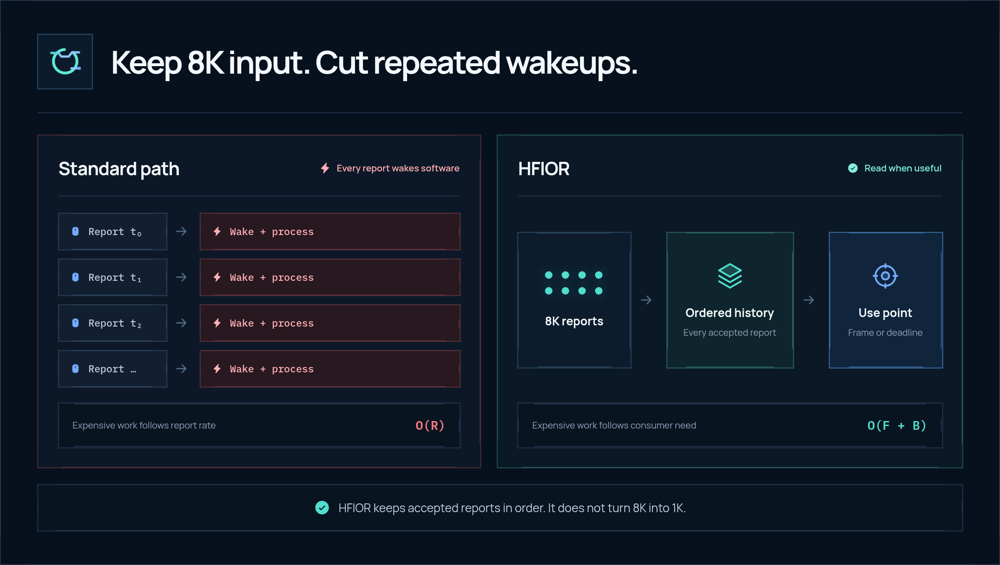
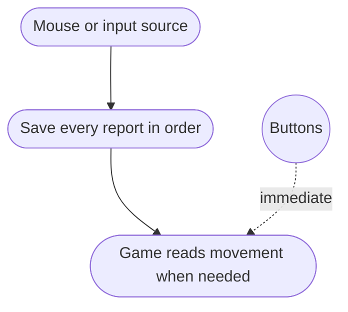
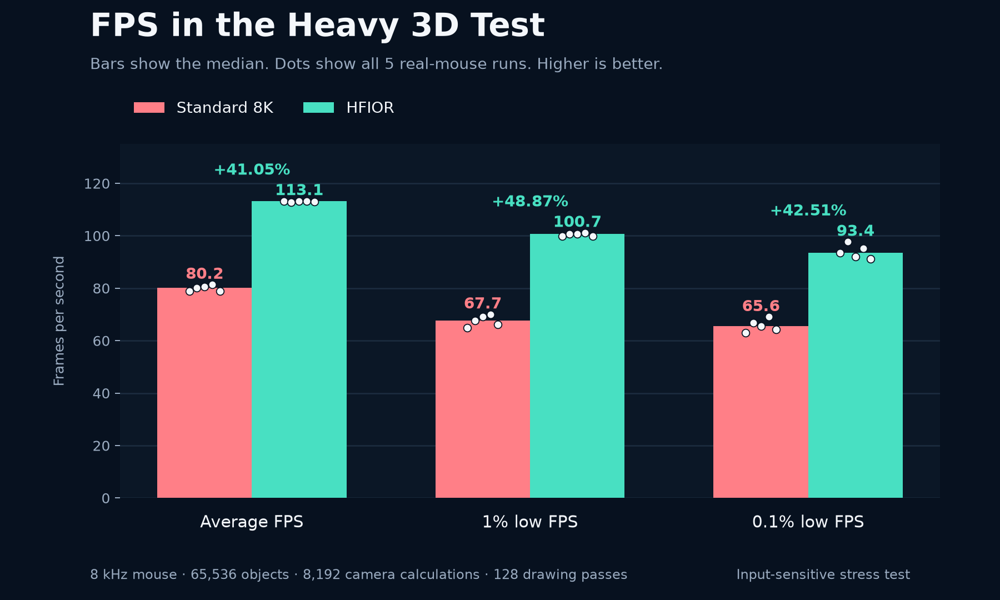
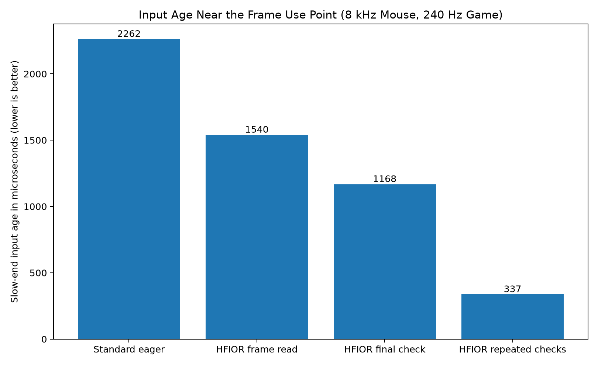
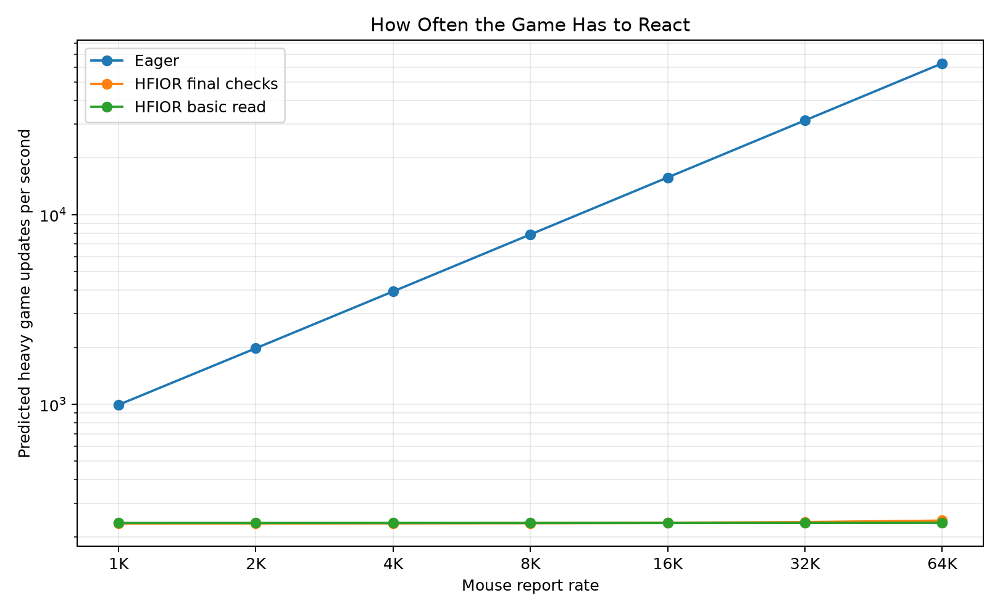
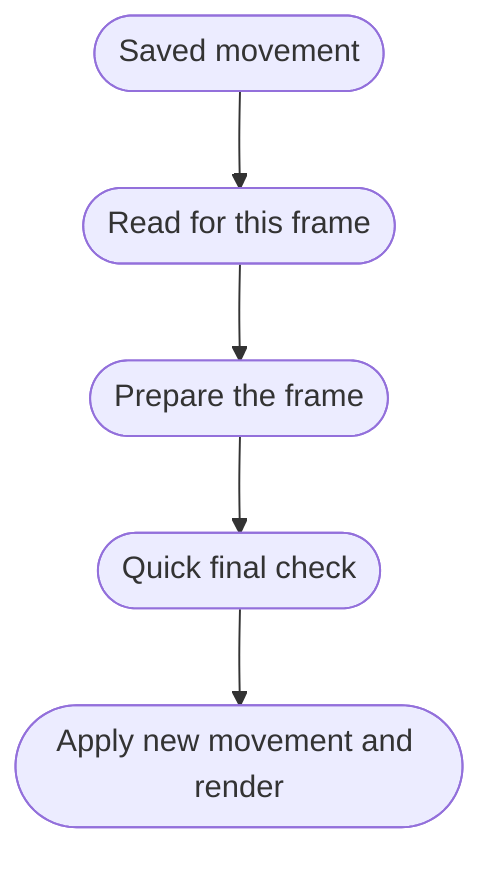

<p align="center">
  
</p>

<p align="center"><strong>Keep high-rate input. Stop making software react to every report.</strong></p>

<p align="center">
  <a href="LICENSE"></a>
  <a href="ROADMAP.md"></a>
  
</p>

HFIOR (High-Frequency Input Observation Ring) keeps every input report it
accepts, but does not make the game do heavy work for every one.

> **Keep every movement. Cut repeated work. Read input right before the game
> needs it.**

<p align="center">
  
</p>

## The problem

An 8 kHz mouse can send up to 8,000 movement reports each second. Many input
systems wake the game and run the same chain of work for every report. A game
running at 240 frames per second usually does not need to repeat heavy camera
work 8,000 times per second.

HFIOR still records the reports at full speed. It lets the game handle the
saved movement when a frame actually needs it:

```text
recording work grows with the mouse rate
heavy game work grows with frames and button presses
```

HFIOR does **not** turn an 8 kHz mouse into a 1 kHz mouse. Each accepted report
stays available and in order. If the history fills up, HFIOR reports the loss
instead of hiding it.

## How it works



The current build keeps the time and order of each report, counts any losses,
and handles disconnects. Applications can read the saved movement but cannot
rewrite it. Developers can read the [architecture](docs/architecture.md),
[memory model](docs/memory-model.md), and
[experimental technical rules](spec/HFIOR.md) for the full details.

### This does not lower the polling rate

HFIOR may read several saved reports at once, but it does not merge them into one
movement. For example, `+3 @ t0` followed by `-3 @ t1` must not become `0`.
That would erase the direction change and its timing. HFIOR keeps both reports.

## What we know so far

| What we tested | Result |
| --- | --- |
| High mouse rate without matching heavy game work | **Shown with real hardware** |
| Movement order and visible loss reporting | **Shown with real hardware** |
| Much less repeated heavy work | **Shown with real hardware** |
| How recent input is when the game uses it | **Measured in the 3D test** |
| Real mouse-to-screen delay | **Not measured yet** |
| Interface for games and apps | **Experimental** |

### Real mouse test in a heavy 3D scene

The current build was tested with a real high-rate mouse and a heavy 3D scene.
The scene used 65,536 simulated objects, 8,192 camera-linked calculations, and
128 drawing passes. The test alternated which mode ran first and kept five valid
runs for each mode.

| Middle result from 5 runs | Standard 8K | HFIOR | Difference |
| --- | ---: | ---: | ---: |
| Mouse reports/s | 7,966 | 7,991 | about the same mouse rate |
| Heavy camera work/s | 7,966 | 113 | **-98.58%** |
| Average FPS | 80.2 | 113.1 | **+41.05%** |
| 1% low FPS | 67.7 | 100.7 | **+48.87%** |
| 0.1% low FPS | 65.6 | 93.4 | **+42.51%** |
| Slow frame time (p99) | 14.52 ms | 9.70 ms | **-33.21%** |
| Typical age of newest input (median) | 4,519 µs | 1,047 µs | **-76.82%** |
| Slow-end age of newest input (p99) | 6,278 µs | 1,893 µs | **-69.84%** |
| Lost / out-of-order reports | 0 / 0 | 0 / 0 | none observed |

<p align="center">
  
</p>

This test is built so repeated mouse work has a clear cost. It does not mean
every game will gain 41%. The delay numbers come from software clocks, not a
high-speed camera filming the mouse and screen. Here, p99 is the slow end: 99%
of measured frames were at or below that value. The 1% and 0.1% low rows show
the slowest moments, where higher is better. `µs` means microseconds, and a
lower input age means the movement was more recent. Check the
[raw frame data](benchmarks/raw/physical-game-8k/),
[how the test works](benchmarks/game/README.md), and [test method](benchmarks/methodology.md).

### Tests with generated mouse input

These tests use program-generated movement instead of a physical mouse. The
first plot shows how recent the newest input was when the game used it. The
second shows how often heavy game work runs as the mouse rate rises. These are
separate from the real-mouse test above.

<p align="center">
  
</p>

<p align="center"><sub>Slow-end input age in a controlled 8 kHz mouse and 240 Hz game test. Lower is better.</sub></p>

<p align="center">
  
</p>

<p align="center"><sub>Predicted heavy game updates as mouse rate rises. Recording each report still takes some work.</sub></p>

You can check the generated-input results yourself: [raw test data](benchmarks/raw/controlled-late-latch/),
[calculated results](benchmarks/processed/hfior/), and [test method](benchmarks/methodology.md).



## Quick start

Requirements: Linux, a C11 compiler, GNU Make, Bash, and Python 3.

```bash
./scripts/build.sh
./scripts/test.sh
./scripts/sanitize.sh
./scripts/benchmark.sh
```

The benchmark command uses generated input and labels its results that way. The
normal build and CI tests do not need a physical mouse or permission to read
Linux input devices. Read [how the benchmarks work](benchmarks/README.md) before
interpreting results.

## What's in this repo

| Path | Purpose |
| --- | --- |
| [`include/hfior/`](include/hfior/) | Experimental code for games and apps |
| [`src/`](src/) | Code that saves and reads input |
| [`reference/`](reference/) | Example input source and reader programs |
| [`spec/`](spec/) | Exact rules and versioning |
| [`integrations/`](integrations/) | Hyprland, Aquamarine, Wayland, and Linux support work |
| [`benchmarks/`](benchmarks/) | Test code, raw results, summaries, and plots |
| [`research/SOURCES.md`](research/SOURCES.md) | Sources and related work |
| [`tests/`](tests/) | Correctness, multi-process, and overflow tests |

## Platform support

[Hyprland + Aquamarine](integrations/hyprland/README.md) is the first platform
being built. The Wayland support is
[experimental and unstable](integrations/wayland/README.md). HFIOR does not
currently require a kernel patch. Kernel work is only considered if
[measurements show it is needed](integrations/linux/README.md).

## Input privacy

HFIOR does not let every application read all mouse input. On Wayland, the
desktop compositor must decide which focused, pointer-locked application may
read the movement history, and it must remove access when that permission ends.
See the [security model](docs/security-model.md) and
[authorization specification](spec/authorization.md).

## Sources and next steps

The [source list](research/SOURCES.md) shows where the design came from. The
[roadmap](ROADMAP.md) puts tests by other people ahead of broader performance
claims or proposals to other projects.

Contributions, independent test results, and skeptical review are welcome.
Read [CONTRIBUTING.md](CONTRIBUTING.md), the [Code of Conduct](CODE_OF_CONDUCT.md),
and [SECURITY.md](SECURITY.md).

Original HFIOR code uses the MIT License. Patches for other projects and outside
material keep their original licenses; see
[THIRD_PARTY_NOTICES.md](THIRD_PARTY_NOTICES.md).
