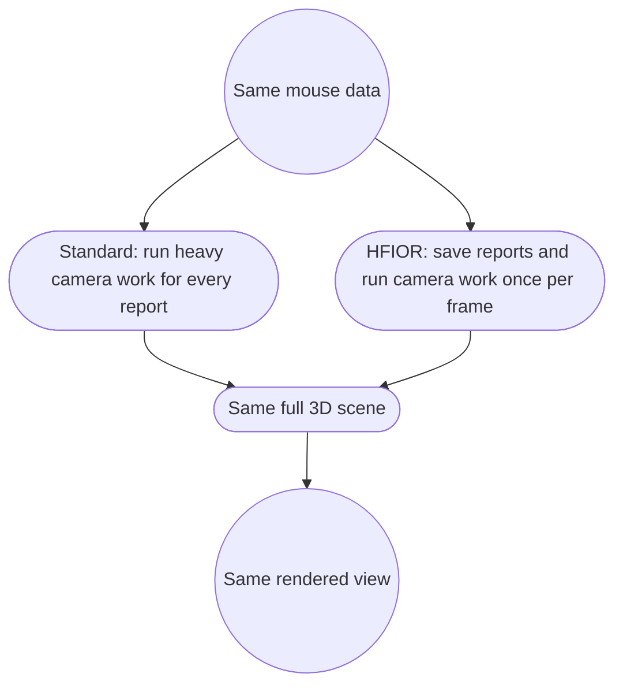

# HFIOR 3D game benchmark

This benchmark measures the question that transport-only tests cannot answer:
does HFIOR help a real rendered workload whose camera path reacts to high-rate
mouse motion?

The default workload is deliberately heavy. Every frame, both modes simulate
65,536 moving objects, perform a complete CPU frustum cull, upload the visible
instance list, run 128 repeated geometry passes with a procedural fragment
shader, and wait for GPU completion. There is no artificial sleep or fake FPS
counter.

Both modes consume the same authorized physical HFIOR ring and run the same
simulation, culling code, shaders, scene, and output. This avoids treating a
frame-coalesced SDL stream as if it were an 8 kHz control:



The eager control does not add per-report thread wakeups, IPC, or transport
overhead. It isolates per-report consumer reactions and therefore gives the
eager side a conservative advantage. Standard SDL motion-event counts are kept
as a separate diagnostic and never substituted for ring records.

This is intentionally a camera-dependent engine workload. It tests the cost of
letting downstream camera work scale with report frequency. It does not claim
that every game currently performs this exact work per mouse record.

## Build

The optional target requires SDL3, libepoxy, Wayland client headers, and
`wayland-scanner`. It is not part of the hardware-free default build.

```bash
make game-benchmark
```

## Run one physical sample

Keep the same scene settings for both modes. Move the mouse continuously during
the warmup and measured interval.

```bash
SDL_VIDEODRIVER=wayland ./build/hfior-game \
  --mode eager \
  --warmup 3 \
  --seconds 15 \
  --objects 65536 \
  --reaction-objects 8192 \
  --draw-repeats 128 \
  --requested-rate 8000 \
  --output benchmark-output/game/eager-01.csv

SDL_VIDEODRIVER=wayland ./build/hfior-game \
  --mode hfior \
  --warmup 3 \
  --seconds 15 \
  --objects 65536 \
  --reaction-objects 8192 \
  --draw-repeats 128 \
  --requested-rate 8000 \
  --output benchmark-output/game/hfior-01.csv
```

The HFIOR run requests the compositor stream only after the window is focused
and SDL has locked the pointer. Click the window if it is waiting.

For the balanced five-pair campaign used by this benchmark:

```bash
./benchmarks/game/run_ab.sh
```

The runner alternates policy order, stops on any rejected run, and writes an
aggregate JSON after all pairs pass. It refuses to overwrite an output
directory that already contains summaries.

Each run writes raw per-frame CSV and a sibling `.summary.json`. The summary
keeps these measurements separate:

- requested rate;
- observed input records per second;
- expensive camera actions per second;
- average, 1% low, and 0.1% low FPS;
- frame-time p50, p95, p99, p99.9, and max;
- useful-sample-age p50, p95, p99, and p99.9;
- process CPU and context switches;
- producer drops and sequence errors.

A requested 8 kHz run is marked invalid below 5,500 observed records/s. Any
HFIOR drop, sequence fault, revocation, focus loss, or rendering failure also
invalidates the run.

## Comparison rules

Run at least five accepted repetitions per mode. Alternate or randomize mode
order, keep the window size and workload fixed, close overlays, and report all
accepted runs. Do not repeat only the slower or faster side. Record mouse,
firmware setting, CPU, GPU, kernel, compositor build, monitor refresh, and power
policy.

This is an interactive physical candidate, not an input-to-photon measurement.
SDL timestamps and compositor-ring timestamps are measured in their respective
monotonic domains at the useful camera boundary. External optical hardware is
still required for a physical motion-to-photon claim.
