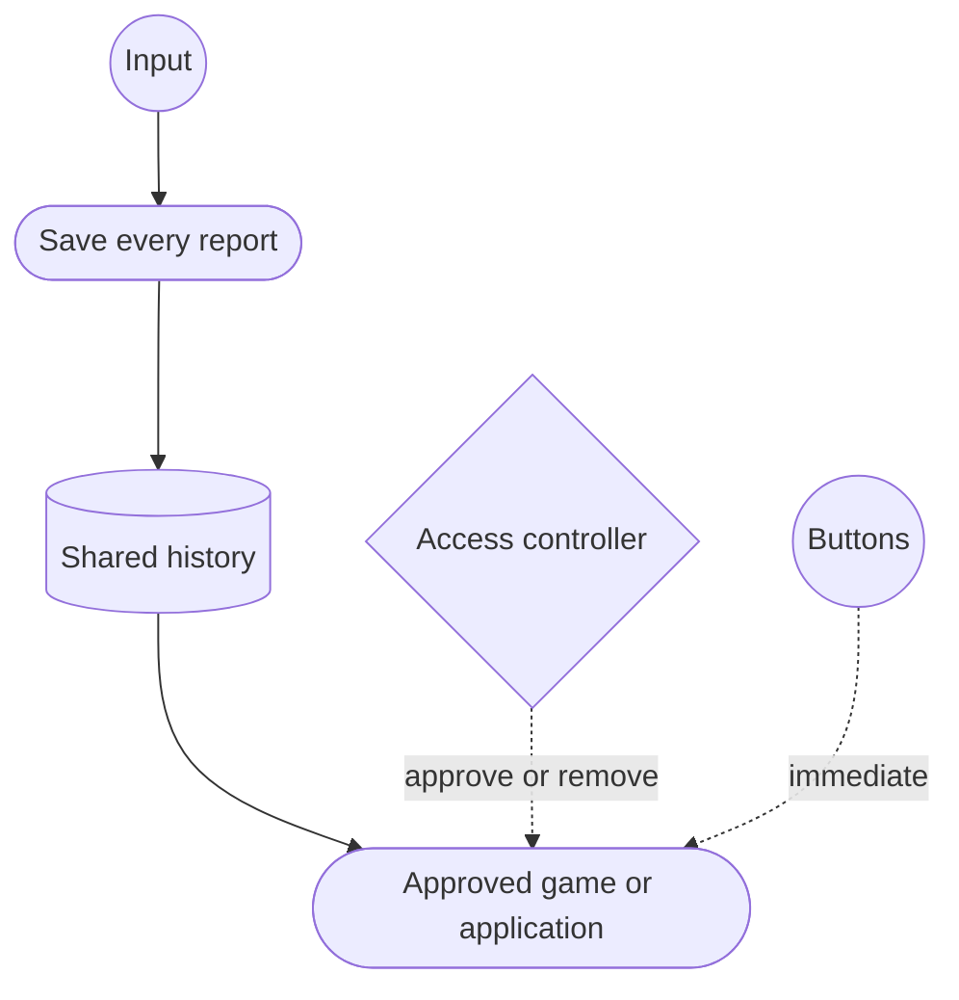
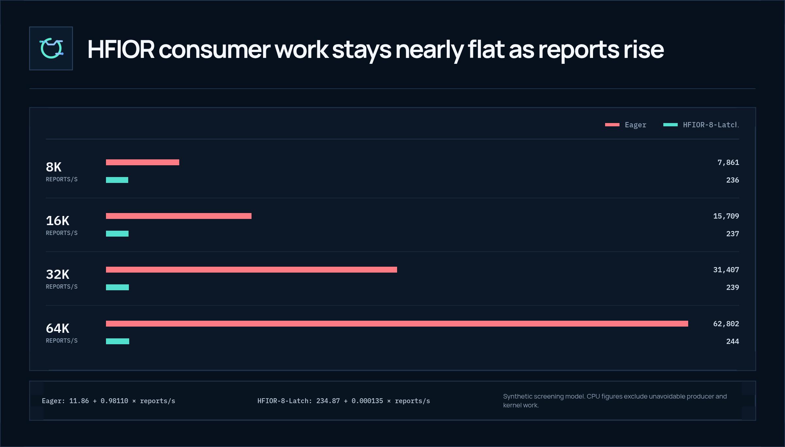

# Architecture

## Separation of rates

Let:

- `R` be report or observation frequency;
- `F` be frame or consumer frequency; and
- `B` be urgent discrete-transition frequency.

A conventional eager path can make expensive work approximately `O(R)`. HFIOR
still records retained information in `O(R)`, but aims for expensive consumer
work near `O(F + B)`. The total system is not `O(1)`: every retained observation
must be published, read, validated, and eventually integrated.

## Abstract roles

**Producer.** Converts observations into immutable sequence-numbered records,
publishes them in order, and accounts for any record it cannot retain.

**Authorization authority.** Decides which consumer may receive a stream and
can revoke it. A Wayland compositor is one possible authority, not a protocol
requirement.

**Shared observation stream.** Exposes published history to an authorized
consumer, preferably without writable access to producer state.

**Consumer.** Maintains a private cursor, integrates every required record, and
reports reclamation progress separately from useful input work.

**Urgent event path.** Delivers transitions such as button presses immediately.
A controlled synthetic test found that forcing these through a sleeping eventfd
consumer added 98 µs at p99, so the reference architecture keeps them distinct.

## Preservation

HFIOR stores records, not just accumulated displacement. If motion is `+3` and
then `−3`, an integrating consumer obtains both timestamps and both directions.
The sum may be zero, but the trajectory is not. When capacity is exhausted, the
producer drops the newest record, increments an explicit counter, and leaves a
detectable sequence discontinuity; it does not silently overwrite unread data.

## Reference implementation

The Linux reference bridge reads evdev or a labeled synthetic source, publishes
32-byte records into a memfd ring, passes a read-only descriptor over a Unix
socket, and validates consumer ACKs. It tracks device generations,
disconnect/reconnect, `SYN_DROPPED`, and urgent transitions. The ABI and
transport are experimental.

## Scaling model

HFIOR fitted the avoidable consumer-reaction term across synthetic report
rates. Observation and publication still scale with `R`; the fitted HFIOR
consumer term does not track report rate over the tested range. This is a
screening model, not a claim that kernel or producer work disappears.

