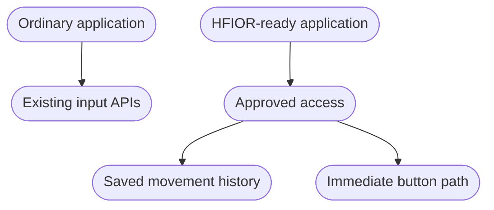

# Compatibility

HFIOR is an optional path. Existing applications continue through established
input APIs; an HFIOR-aware application or runtime requests authorized history.

The current reference path uses an experimental Wayland integration. Consumers
must preserve application sensitivity, acceleration, coordinate transforms,
and button semantics at the same logical boundary as the conventional path.

Fallback is required. If authorization, ABI negotiation, mapping, validation,
or device generation fails, the integration should use the conventional API
without changing user-visible configuration.
