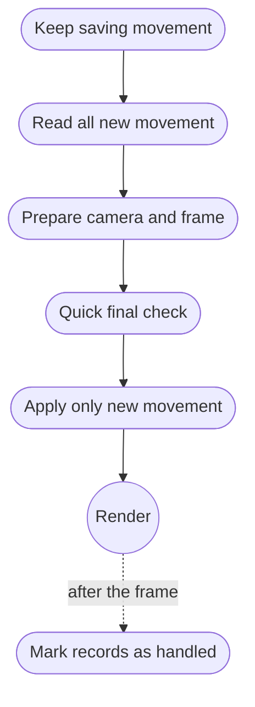

# Late latching

HFIOR-Late-Latch is the recommended consumption policy:

The final latch does not repeat the game's full input logic. Instead, it visits
only the records committed since normal history integration and applies that
suffix to state that remains safe to correct.

The frame thread may already be running when an eager ingress worker sleeps or
loses its timeslice. That window matters. A direct read at the use point can
then see a committed record that still has not reached the application's event
queue. Synthetic traces demonstrated that mechanism. The controlled
physical-input game benchmark also measured lower software useful-sample age at
its camera boundary. Optical motion-to-photon superiority is **not yet
established**.

HFIOR-8-Latch performs up to eight additional cheap checks while the frame
thread is awake. It produced the best tail result in the controlled synthetic
trace, but its CPU results varied more under KVM. The simpler Late-Latch policy
therefore remains the default policy.
