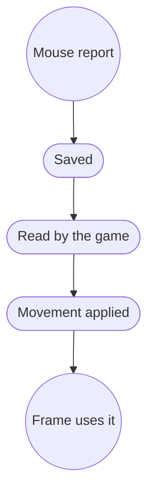

# Latency model

HFIOR evaluates latency at the point where input becomes useful to a consumer,
not merely when a worker thread receives an event.

The useful-sample age of a frame is the useful-boundary timestamp minus the
newest source timestamp incorporated by that boundary. The boundary and clock
domain must be recorded; negative values are evidence of a measurement error,
not values to clamp away.

An early harness took its timestamp before the HFIOR drain and then calculated
age from records returned by that drain. A record could therefore arrive after
the timestamp. Current measurements place the boundary after integration and
the final suffix latch.

Report p50, p95, p99, p99.9, and maximum where the run length supports them.
Tail events should be joined to producer publication, scheduling, latch, and
frame-overrun traces rather than attributed by guesswork.
